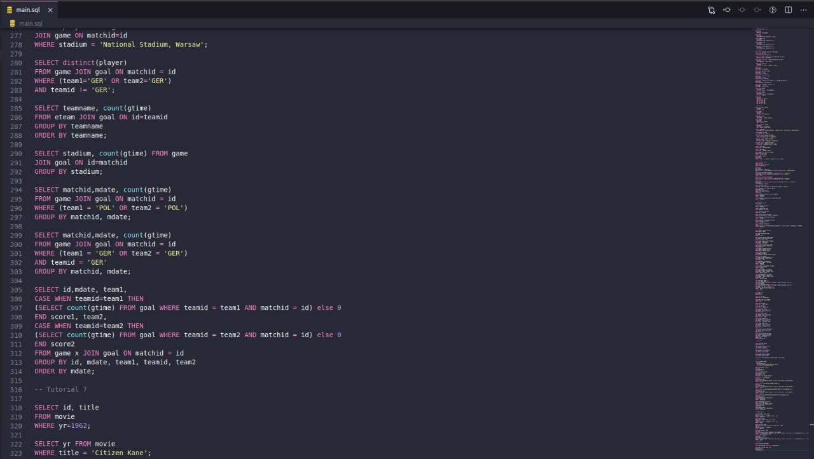

# SQL Project
This is a repository for the SQL microverse project.

The final goal of this project is to test the knowledge acquired of the SQL language, I resolved the [SQLzoo](https://sqlzoo.net/wiki/SQL_Tutorial) tutorial, and put the answers inside this repository.

## Built With

- SQL

The code:

### Author

👤 *Miguel Ricaño*

- Github: [@mricanho](https://github.com/mricanho)
- Linkedin: [Miguel Ricaño](https://www.linkedin.com/in/mricanho/)

## Show your support

Give a ⭐️ if you like this project!

## Acknowledgments

- Microverse
- The Odin Project

## 📝 License

This project is [MIT](LICENSE.md) licensed.